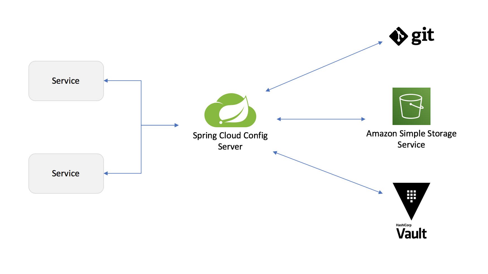

# ProjectPixapp

A spring boot project that follows a **microservice architecture**.
The final architecture developed is given below:


### What is a microservice ?

**Microservices** are a sort of development technique - a variant of a service oriented architectural style (SOA) that structures an application as a collection of loosely coupled services.
In microservices architecture services are fine grained and the benefit of decomposing an application into different smaller services is that it improves modularity.

This makes the application easier to understand develop and test and it becomes more resilient to architecture erosion.
It parallelizes development by enabling small autonomous teams to develop, deploy and scale their respective services independently.

### Microservice vs Monolithic Application

**Monolithic architecture** is built as one large system and is usually one code-base. 
Monolithic application is tightly coupled and entangled as the application evolves, making it difficult to isolate services for purposes such as independent scaling or code maintainability.
It is extremely difficult to change technology or language or framework because everything is tightly coupled and depend on each other.

**Microservices architecture** is built as small independent module based on business functionality. 
In microservices application, each project and services are independent from each other at the code level. 
Therefore it is easy to configure and deploy completely and also easy to scale based on demand.


This project comprises of several microservices. A brief description of each microservice is given below along with some other features that help with 
distributing configuration properties on runtime, logging server logs, encryption and decryption, and several other tasks.

## [Eureka Discovery Service (Eureka Server)](./PixappDiscoveryService)

When each instance of a microservice start up, it will register itself with **Eureka Discovery Service**.
So Eureka will know the address of each microservice.
And if there are three instances of the same microservice, Eureka will know the address of each of them.
You do not need to open Eureka configuration file and manually add the location of your microservice type.

So if load on your application increases and you need to start up ten more instances of a microservice, then you can easily do that.
And each new microservice will have registered with Eureka itself and Eureka will know where it is located.
It will know which IP address and which port number to use.

Similarly, when you do not need so many instances of products microservice, you can stop some of them.
And when you stop the not needed microservices, their location will be removed from Eureka.
So this helps you to quickly scale up your application up and down as needed without manually configuring and removing the location of each microservice from Eureka Discovery.


### Useful Code

`@EnableEurekaServer`

```
<dependency>
    <groupId>org.springframework.cloud</groupId>
    <artifactId>spring-cloud-starter-netflix-eureka-server</artifactId>
</dependency>
```

```
server.port = 8010
spring.application.name = discoveryservice
eureka.client.register-with-eureka = false
eureka.client.fetch-registry = false
eureka.client.serviceUrl.defaultZone = http://localhost:8010/eureka
eureka.instance.prefer-ip-address = true
```

**For clients**
```
<dependency>
    <groupId>org.springframework.cloud</groupId>
    <artifactId>spring-cloud-starter-netflix-eureka-client</artifactId>
</dependency>
```

## [Spring Cloud API Gateway](./ApiGateway)

**Spring Cloud Gateway** provides a library for building API gateways on top of Spring and Java. 
It provides a flexible way of routing requests based on a number of criteria, as well as focuses on cross-cutting concerns such as security, resiliency, and monitoring.

The first component in the flow is a **Gateway Handler Mapping**. 
If the Gateway Handler Mapping determines that a request matches a configured route, it is sent to **Gateway Web Handler**.
Gateway Web Handler will take the request through a set of filters configured for that route.
So if a request matches the route, the Gateway Web Handler will route the request through a filter chain that is specific to the request 
and you can configure multiple filters to be executed for a specific gateway route.

There can be pre-filters and post-filters.
Pre-filters are filters that execute their logic before the proxy request is made and post-filters are filters that execute their logic after proxy request is made.

This project uses a custom filter will validate if the JWT access token that was included in the authorization header is valid or not.
If the token is not valid, the request will not pass through.
But if the JWT token is valid, then the request will pass through and the destination microservice can
perform additional authorization to make sure that this user is actually allowed to perform the requested operation or access the requested information.


### Useful code

```
<dependency>
    <groupId>org.springframework.boot</groupId>
    <artifactId>spring-boot-starter-webflux</artifactId>
</dependency>
<dependency>
    <groupId>org.springframework.cloud</groupId>
    <artifactId>spring-cloud-starter-gateway</artifactId>
</dependency>
```

```
spring.cloud.gateway.routes[0].id = users-status
spring.cloud.gateway.routes[0].uri = lb://users-ws
spring.cloud.gateway.routes[0].predicates[0] = Path=/users-ws/users/status
spring.cloud.gateway.routes[0].predicates[1] = Method=GET
spring.cloud.gateway.routes[0].predicates[2] = Header=Authorization, Bearer (.*)
spring.cloud.gateway.routes[0].filters[0] = RemoveRequestHeader=Cookie
spring.cloud.gateway.routes[0].filters[1] = RewritePath=/users-ws/(?<segment>.*), /$\{segment}
spring.cloud.gateway.routes[0].filters[2] = AuthorizationHeaderFilter
```

## [Spring Cloud Config Server](./PixappConfigServer)

**Spring Cloud Config Server** provides a server side and the client side support for externalized configuration in a distributed system.
With spring cloud config server we have a central place to manage external properties for applications across all environments.
The central secure storage can be a secure file system storage backend, a secure vault backend or a private repository.
The external configuration created and managed with the help of spring cloud config server will be available to all microservices via an environment object.



In this project a private repository on github is used as the external configuration storage for the microservices.
Spring cloud config server is also a spring boot application and it will let other microservices connect to it via HTTP and retrieve their configuration details when they start up.
We can still have some application configuration kept in application properties file but if we use Spring Cloud Config Server then the configuration that comes from Spring Cloud Config Server will have a higher priority.
So if we have same property stored in a local application properties file and in an external repository, it is the value that is served by spring cloud config server from a GIT repository that will be used.

### Useful Code

`@EnableConfigServer`

```
<dependency>
    <groupId>org.springframework.cloud</groupId>
    <artifactId>spring-cloud-config-server</artifactId>
</dependency>
<dependency>
    <groupId>org.springframework.cloud</groupId>
    <artifactId>spring-cloud-starter-bootstrap</artifactId>
</dependency>
```

```
spring.profiles.active = git
spring.cloud.config.server.git.uri = private_repo_url
spring.cloud.config.server.git.username = github_username
spring.cloud.config.server.git.password = github_password
spring.cloud.config.server.git.clone-on-start = true
spring.cloud.config.server.git.default-label = main
```

**For clients**

```
<dependency>
    <groupId>org.springframework.cloud</groupId>
    <artifactId>spring-cloud-config-server</artifactId>
</dependency>
<dependency>
    <groupId>org.springframework.cloud</groupId>
    <artifactId>spring-cloud-starter-bootstrap</artifactId>
</dependency>
```

```
spring.cloud.config.uri = http://localhost:8012
spring.cloud.config.name = users-ws
```

## [Users Microservice](./PixappUsersApi)

This microservice supports all user related operations.
This is a Web Service API that has GET, POST, PUT and DELETE endpoints to perform all CRUD operations on user data.

> ***Currently implemented endpoints include `create user`, `user login`, `service status` and `get user details`.***

### Useful Code

```
<dependency>
    <groupId>org.springframework.boot</groupId>
    <artifactId>spring-boot-starter-web</artifactId>
</dependency>
```

>*The other two microservices are the [albums microservice](./PixappAlbumsApi) and the [account management microservice](./PixappAccountsApi).
The Albums Microservice is a Web Service API that performs operations related to the photos of the registered users.
The Account Management Microservice is Web Service API that has endpoints to perform account management operations like email verification and password reset.*

>***These microservices are yet to be implemented and thus might only contain dummy contents.***

## Spring Cloud Bus

**Spring Cloud Bus** links nodes of a distributed system with a lightweight message broker. 
This can then be used to broadcast state changes (e.g. configuration changes) or other management instructions.
Spring cloud bus help to push configuration changes to all microservices while they are running.
And for microservices to receive these updated configuration changes and to start using the new values they do not need to be restarted.

Adding the spring cloud bus dependencies will make our microservices work as listeners or subscribers to receive updates from Spring cloud config server 
and these updates will be broadcast to all subscribed microservices with the help of messaging technology.
The protocol used is AMQP which stands for **Advanced Message Queueing Protocol** and it enables applications that use it to connect and scale.


This Messenger is asynchronous and it decouple application by separating sending and receiving data with the help of a message broker called RabbitMQ.
**RabbitMQ** is a message broker and it is an intermediary for messenger.
It gives applications a common platform to send and receive messages and a safe place for messages to live until they are received.

### Useful Code

```
<dependency>
    <groupId>org.springframework.cloud</groupId>
    <artifactId>spring-cloud-starter-bus-amqp</artifactId>
</dependency>
<dependency>
    <groupId>org.springframework.boot</groupId>
    <artifactId>spring-boot-starter-actuator</artifactId>
</dependency>
```

```
spring.rabbitmq.host = localhost
spring.rabbitmq.port = 5672
spring.rabbitmq.username = rabbitmq_username
spring.rabbitmq.password = rabbitmq_password
```

**For config server:** 
`management.endpoints.web.exposure.include = busrefresh`

## Spring Boot Actuator

**Spring Boot Actuator** is a sub-project of the Spring Boot Framework. 
It includes a number of additional features that help us to monitor and manage the Spring Boot application when you push it to production. 
It contains the actuator endpoints (the place where the resources live).
You can choose to manage and monitor your application by using HTTP endpoints or with JMX. 
Auditing, health, and metrics gathering can also be automatically applied to your application.

### Useful code

```
management.endpoint.gateway.enabled = true
management.endpoints.web.exposure.include = beans,health,routes,httptrace
```

## Microservice Communication with Feign Client

**Feign** is a declarative web service client. It makes writing web service clients easier.
Feign is an HTTP client which helps springboot applications to programmatically send an HTTP request to a remote or an internal microservice and then get back response.

`@EnableFeignClients`
`@FeignClient(name = "albums-ws")`

```
<dependency>
    <groupId>org.springframework.cloud</groupId>
    <artifactId>spring-cloud-starter-openfeign</artifactId>
</dependency>
```

**Enable logging in Feign Client**
```
logging.file.name = PixappUsersApi/users-ws.log
logging.level.com.athul.pixapp.api.users.data.AlbumsServiceClient = DEBUG
```

```
@Bean
public Logger.Level feignLoggerLevel() {
    return Logger.Level.FULL;
}
```

**Hystrix Circuit Breaker**

`@EnableCircuitBreaker`
`@FeignClient(name = "albums-ws", fallbackFactory = AlbumsFallbackFactory.class)`

`feign.circuitbreaker.enabled = true`

```
<dependency>
    <groupId>org.springframework.cloud</groupId>
    <artifactId>spring-cloud-starter-netflix-hystrix</artifactId>
    <version>2.2.8.RELEASE</version>
</dependency>
```

## Distributed Tracing with Sleuth and Zipkin

**Zipkin** is a very efficient tool for distributed tracing in microservices ecosystem. 
Distributed tracing, in general, is latency measurement of each component in a distributed transaction where multiple microservices are invoked to serve a single business usecase.
**Sleuth** configures everything you need to get started. This includes where trace data (spans) are reported to, how many traces to keep (sampling), if remote fields (baggage) are sent, and which libraries are traced.

Specifically, Spring Cloud Sleuth:
- Adds trace and span ids to the Slf4J MDC, so you can extract all the logs from a given trace or span in a log aggregator.
- Instruments common ingress and egress points from Spring applications (servlet filter, rest template, scheduled actions, message channels, feign client).
- If spring-cloud-sleuth-zipkin is available then the app will generate and report Zipkin-compatible traces via HTTP. By default it sends them to a Zipkin collector service on localhost (port 9411).


### Useful Code

```
<dependency>
    <groupId>org.springframework.cloud</groupId>
    <artifactId>spring-cloud-starter-sleuth</artifactId>
</dependency>
<dependency>
    <groupId>org.springframework.cloud</groupId>
    <artifactId>spring-cloud-sleuth-zipkin</artifactId>
</dependency>
```

```
spring.zipkin.base-url = http://localhost:9411
spring.zipkin.sender.type = web
spring.sleuth.sampler.probability = 1
```

***Designed and Developed by Athul Krishna K S***